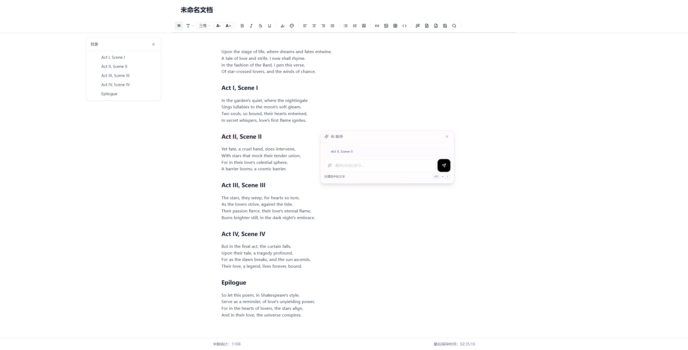
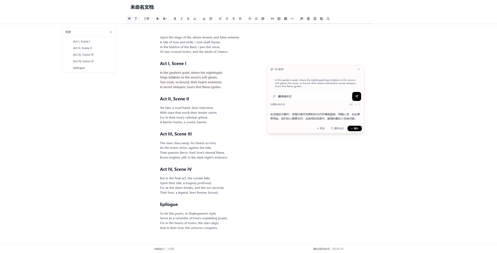
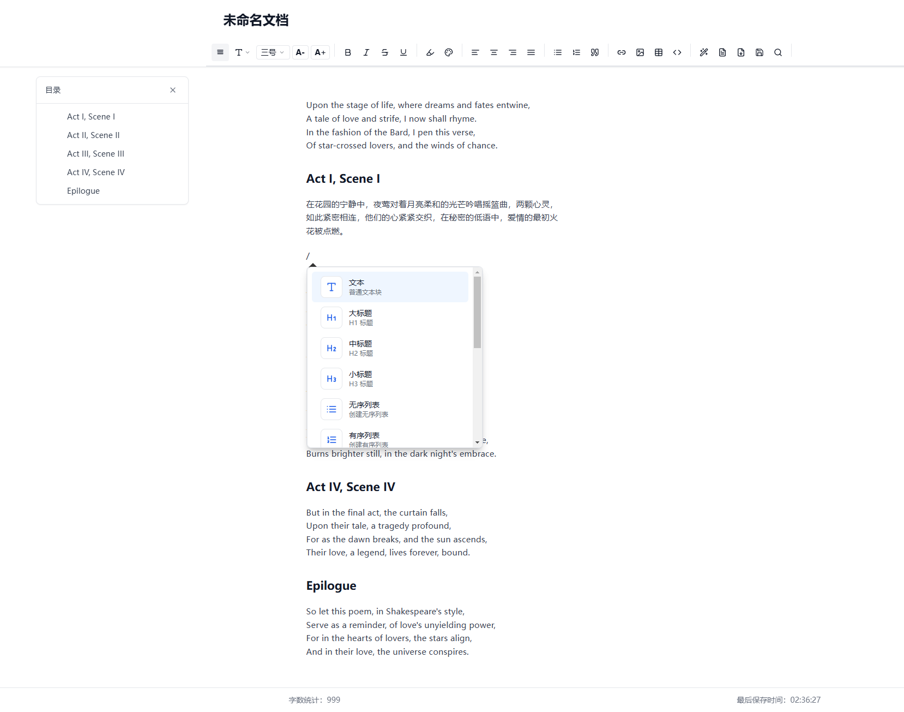

# AI Document Editor

<p align="center">
  <strong>A modern, AI-powered rich text editor designed for document creation and collaboration</strong>
</p>

<p align="center">
  <strong>Developed by <a href="https://www.eoait.com" target="_blank">Guangdong Star Era Network Technology Co., Ltd.</a></strong>
</p>

<p align="center">
  <a href="https://aidoc.eoait.com" target="_blank">Live Demo</a> •
  <a href="#features">Features</a> •
  <a href="#quick-start">Quick Start</a> •
  <a href="#user-guide">User Guide</a> •
  <a href="#tech-stack">Tech Stack</a> •
  <a href="#contribution-guidelines">Contribution</a> •
  <a href="#license">License</a>
</p>

<p align="center">
  <strong>Repository: <a href="https://gitee.com/eoait2024/open-source-ai-editor" target="_blank">https://gitee.com/eoait2024/open-source-ai-editor</a></strong>
</p>

<p align="center">
  <strong><a href="README.md">中文文档</a></strong>
</p>

<p align="center">
  
</p>

## Features

🚀 **Modern Editing Experience**
- Powerful rich text editing based on TipTap and ProseMirror
- Support for Markdown syntax and shortcuts
- Smooth editing experience with animations
- Rich text editing features for all document needs
- Command menu for quick insertion of new content blocks

🤖 **AI Assistance**
- Built-in AI assistant to help generate and rewrite text
- Support for custom instructions for content generation and rewriting
- Cool AI content insertion animation effects
- Compatible with various AI model interfaces in OpenAI format

<p align="center">
  
  
</p>

📝 **Comprehensive Document Features**
- Support for headings, lists, tables, code blocks, and more
- Automatic table of contents generation with collapse/expand support
- Text highlighting, color, and font size adjustment
- Find and replace functionality
- Word count feature

💾 **Convenient User Experience**
- No login required, lowering the barrier to use
- Auto-save functionality to prevent content loss
- Export to Word document (.docx)
- Document title management

<p align="center">
  
  
</p>

🎨 **Beautiful User Interface**
- Modern design based on Tailwind CSS
- Responsive layout for various devices
- Custom theme support

## Quick Start

### Prerequisites

- Node.js 18.0.0 or higher
- pnpm 8.0.0 or higher

### Installation

1. Clone the repository
```bash
git clone https://gitee.com/eoait2024/open-source-ai-editor.git
cd open-source-ai-editor
```

2. Install dependencies
```bash
pnpm install
```

3. Configure environment variables
```bash
cp .env.example .env
```
Edit the `.env` file to add necessary API keys (supports various AI interfaces in OpenAI format).

4. Start the development server
```bash
pnpm dev
```

5. Open [http://localhost:3000](http://localhost:3000) in your browser

### Docker Deployment

We also provide Docker deployment options. For details, please refer to [DOCKER_IMAGE_README.md](DOCKER_IMAGE_README.md).

1. Build Docker image
```bash
docker build -t ai-doc-editor .
```

2. Run Docker container
```bash
docker run -p 3000:3000 -e OPENAI_API_KEY=your_api_key_here ai-doc-editor
```

## User Guide

### Basic Editing

- Use the toolbar to format text
- Support for shortcuts (Ctrl+B for bold, Ctrl+I for italic, etc.)
- Type `/` to trigger the command menu for quick insertion of new content blocks

### AI Features

- Select text and press `Alt + /` to trigger the AI assistant
- AI can help generate new content or rewrite selected text
- Support for custom AI instructions to meet personalized needs
- Generated content is inserted with smooth animation effects

### Document Management

- No login required, data automatically saved locally
- Support for generating and updating table of contents
- Find and replace functionality (Ctrl+F)
- Table editing and management
- Word count feature

### Export Document

- Click the export button in the toolbar
- Choose whether to include the document title
- Document will be downloaded in .docx format

## Tech Stack

- **Frontend Framework**: 
  - [Next.js](https://nextjs.org/) 15.1.7
  - [React](https://reactjs.org/) 19.0.0
  - [TypeScript](https://www.typescriptlang.org/) 5.x

- **Editor Core**: 
  - [TipTap](https://tiptap.dev/) 2.11.5
  - [ProseMirror](https://prosemirror.net/) libraries
  - Various TipTap extensions (tables, code blocks, task lists, etc.)

- **Styling & UI**: 
  - [Tailwind CSS](https://tailwindcss.com/) 3.4.1
  - [Radix UI](https://www.radix-ui.com/) component library
  - [Lucide React](https://lucide.dev/) icon library
  - [Framer Motion](https://www.framer.com/motion/) animation effects

- **Document Processing**: 
  - [docx](https://docx.js.org/) 9.2.0
  - [markdown-it](https://github.com/markdown-it/markdown-it) 14.1.0

- **Data Processing**:
  - [Lodash](https://lodash.com/) 4.17.21
  - [@tanstack/react-table](https://tanstack.com/table/latest) 8.21.2

- **AI Integration**: 
  - [OpenAI API Client](https://github.com/openai/openai-node) 4.85.4
  - Support for various AI interfaces in OpenAI format
  - Currently using Grok-2 model (with $150 balance)
  - Will switch to Zhipu GLM-4-Flash in the future

- **Development Tools**:
  - [ESLint](https://eslint.org/) 9.x
  - [PostCSS](https://postcss.org/) 8.x
  - [TurboPack](https://turbo.build/pack) high-performance bundler

## Roadmap

Here are the features we plan to add in the next version:

- [ ] Block handle support (drag to adjust document structure)
- [ ] Data visualization features
- [ ] Custom AI model configuration
- [ ] Dark mode support
- [ ] Collaborative editing
- [ ] More export formats (PDF, Markdown)
- [ ] Image upload and management
- [ ] Version history and rollback
- [ ] Image generation features

## Contribution Guidelines

We welcome all forms of contribution, whether it's new features, bug fixes, or documentation improvements.

1. Fork this repository
2. Create your feature branch (`git checkout -b feature/amazing-feature`)
3. Commit your changes (`git commit -m 'Add some amazing feature'`)
4. Push to the branch (`git push origin feature/amazing-feature`)
5. Open a Pull Request

Please ensure your code follows the project's code style and best practices.

## License

This project uses a modified MIT license - see the [LICENSE](LICENSE) file for details. This license adds the following restrictions to the standard MIT license:

- Modifications must be clearly marked
- Original attribution and copyright notices must be retained
- Specific commercial uses require written permission
- Patent use requires necessary licenses

Copyright © 2023-2024 <a href="https://www.eoait.com" target="_blank">Guangdong Star Era Network Technology Co., Ltd.</a>

## Contact Us

If you have any questions or suggestions, please contact us through:

- Official Website: [https://www.eoait.com](https://www.eoait.com)
- Live Demo: [https://aidoc.eoait.com](https://aidoc.eoait.com)
- Feedback: Please send an email to [johnson@eoait.com](mailto:johnson@eoait.com) or submit an issue on [Gitee Issues](https://gitee.com/eoait2024/open-source-ai-editor/issues)

---

<p align="center">
  <strong>Made by <a href="https://www.eoait.com" target="_blank">Guangdong Star Era Network Technology Co., Ltd.</a></strong>
</p>
<p align="center">
  Made with ❤️
</p> 