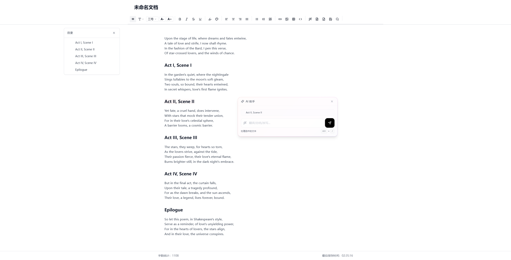
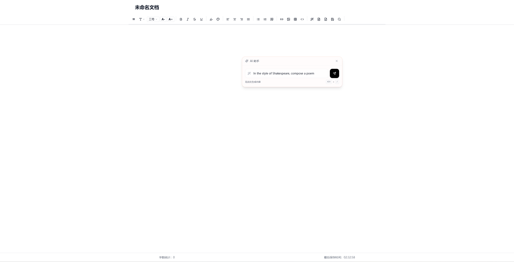
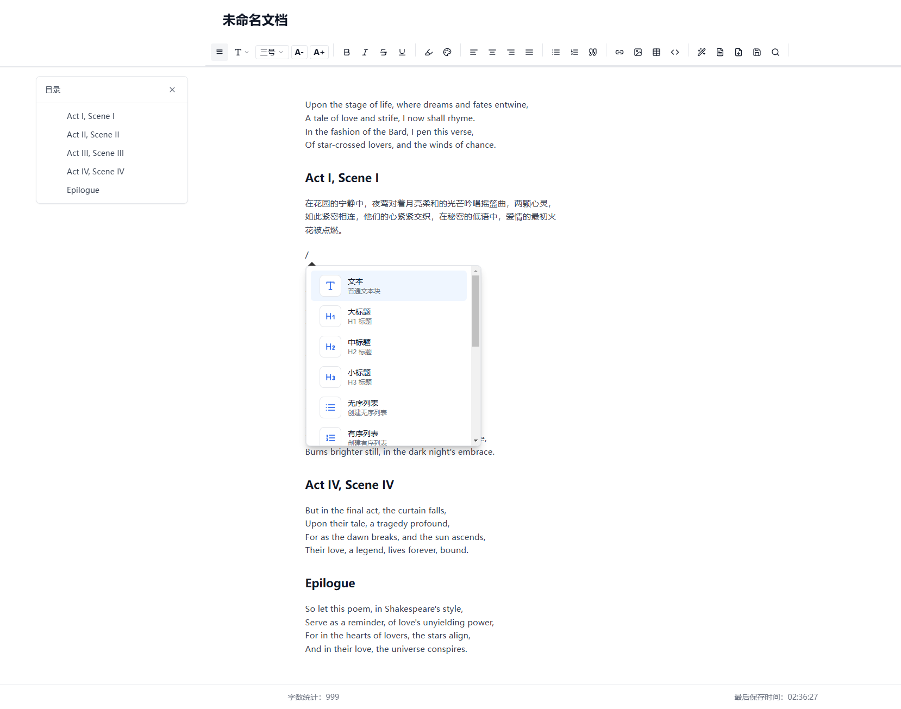
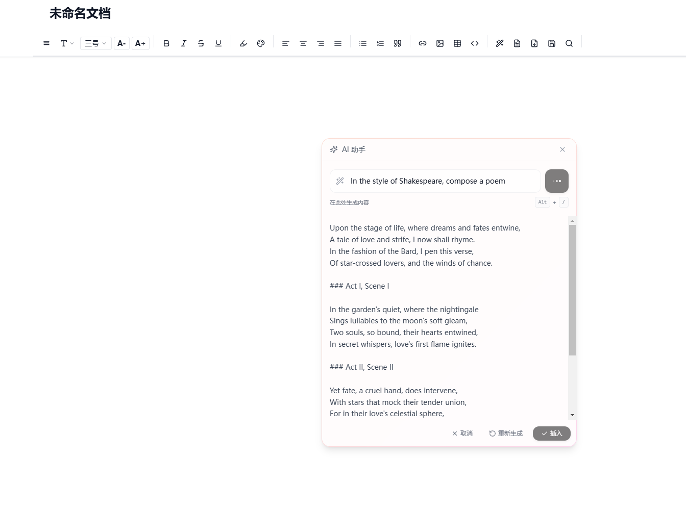

# AI 文档编辑器

<p align="center">
  <strong>一个现代化的、AI驱动的富文本编辑器，专为文档创作和协作设计</strong>
</p>

<p align="center">
  <strong>由 <a href="https://www.eoait.com" target="_blank">广东星时代网络技术有限公司</a> 开发</strong>
</p>

<p align="center">
  <a href="https://aidoc.eoait.com" target="_blank">在线演示</a> •
  <a href="#特性">特性</a> •
  <a href="#快速开始">快速开始</a> •
  <a href="#使用指南">使用指南</a> •
  <a href="#技术栈">技术栈</a> •
  <a href="#贡献指南">贡献指南</a> •
  <a href="#许可证">许可证</a>
</p>

<p align="center">
  <strong>仓库地址：<a href="https://gitee.com/eoait2024/open-source-ai-editor" target="_blank">https://gitee.com/eoait2024/open-source-ai-editor</a></strong>
</p>

<p align="center">
  <strong><a href="README.md">English Documentation</a></strong>
</p>

<p align="center">
  
</p>

## 特性

🚀 **现代化编辑体验**
- 基于 TipTap 和 ProseMirror 的强大富文本编辑功能
- 支持 Markdown 语法和快捷键
- 丝滑的编辑体验和动画效果
- 丰富的富文本编辑功能，满足各种文档需求
- 命令菜单快速插入新的内容块

🤖 **AI 辅助功能**
- 内置 AI 助手，帮助生成和改写文本
- 支持自定义指令进行内容生成和改写
- 炫酷的 AI 内容插入动画效果
- 兼容 OpenAI 格式的各类 AI 模型接口

<p align="center">
  
  
</p>

📝 **全面的文档功能**
- 支持标题、列表、表格、代码块等丰富元素
- 自动生成目录，支持折叠和展开
- 文本高亮、颜色和字体大小调整
- 查找和替换功能
- 字数统计功能

💾 **便捷的使用体验**
- 免登录即可使用，降低使用门槛
- 自动保存功能，不怕内容丢失
- 导出为 Word 文档 (.docx)
- 文档标题管理

<p align="center">
  
  
</p>

🎨 **美观的用户界面**
- 基于 Tailwind CSS 的现代设计
- 响应式布局，适配各种设备
- 自定义主题支持

## 快速开始

### 前提条件

- Node.js 18.0.0 或更高版本
- pnpm 8.0.0 或更高版本

### 安装

1. 克隆仓库
```bash
git clone https://gitee.com/eoait2024/open-source-ai-editor.git
cd open-source-ai-editor
```

2. 安装依赖
```bash
pnpm install
```

3. 配置环境变量
```bash
cp .env.example .env
```
编辑 `.env` 文件，添加必要的 API 密钥（支持 OpenAI 格式的各类 AI 接口）。

4. 启动开发服务器
```bash
pnpm dev
```

5. 在浏览器中打开 [http://localhost:3000](http://localhost:3000)

### Docker 部署

我们也提供了 Docker 部署方式，详情请参考 [DOCKER_IMAGE_README.md](DOCKER_IMAGE_README.md)。

1. 构建 Docker 镜像
```bash
docker build -t ai-doc-editor .
```

2. 运行 Docker 容器
```bash
docker run -p 3000:3000 -e OPENAI_API_KEY=your_api_key_here ai-doc-editor
```

## 使用指南

### 基本编辑

- 使用工具栏格式化文本
- 支持快捷键（Ctrl+B 加粗，Ctrl+I 斜体等）
- 输入 `/` 触发命令菜单，快速插入新的内容块

### AI 功能

- 选中文本后按 `Alt + /` 触发 AI 助手
- AI 可以帮助生成新内容或改写选中的文本
- 支持自定义 AI 指令，满足个性化需求
- 生成的内容会以平滑的动画效果插入

### 文档管理

- 免登录即可使用，数据自动保存在本地
- 支持生成和更新目录
- 查找和替换功能（Ctrl+F）
- 表格编辑和管理
- 字数统计功能

### 导出文档

- 点击工具栏中的导出按钮
- 选择是否包含文档标题
- 文档将以 .docx 格式下载

## 技术栈

- **前端框架**: 
  - [Next.js](https://nextjs.org/) 15.1.7
  - [React](https://reactjs.org/) 19.0.0
  - [TypeScript](https://www.typescriptlang.org/) 5.x

- **编辑器核心**: 
  - [TipTap](https://tiptap.dev/) 2.11.5
  - [ProseMirror](https://prosemirror.net/) 系列库
  - 多种 TipTap 扩展（表格、代码块、任务列表等）

- **样式与UI**: 
  - [Tailwind CSS](https://tailwindcss.com/) 3.4.1
  - [Radix UI](https://www.radix-ui.com/) 组件库
  - [Lucide React](https://lucide.dev/) 图标库
  - [Framer Motion](https://www.framer.com/motion/) 动画效果

- **文档处理**: 
  - [docx](https://docx.js.org/) 9.2.0
  - [markdown-it](https://github.com/markdown-it/markdown-it) 14.1.0

- **数据处理**:
  - [Lodash](https://lodash.com/) 4.17.21
  - [@tanstack/react-table](https://tanstack.com/table/latest) 8.21.2

- **AI 集成**: 
  - [OpenAI API 客户端](https://github.com/openai/openai-node) 4.85.4
  - 支持 OpenAI 格式的各类 AI 接口
  - 当前使用 Grok-2 模型（有 150 美金余额）
  - 后续将切换至智谱 GLM-4-Flash

- **开发工具**:
  - [ESLint](https://eslint.org/) 9.x
  - [PostCSS](https://postcss.org/) 8.x
  - [TurboPack](https://turbo.build/pack) 高性能打包工具

## 路线图

以下是我们计划在下一版本中添加的功能：

- [ ] 块句柄支持（拖拽调整文档结构）
- [ ] 数据可视化功能
- [ ] 自定义 AI 模型配置
- [ ] 暗色模式支持
- [ ] 协作编辑功能
- [ ] 更多导出格式（PDF、Markdown  ）
- [ ] 图片上传和管理
- [ ] 版本历史和回滚
- [ ] 图像生成功能

## 贡献指南

我们欢迎所有形式的贡献，无论是新功能、bug 修复还是文档改进。

1. Fork 这个仓库
2. 创建你的特性分支 (`git checkout -b feature/amazing-feature`)
3. 提交你的更改 (`git commit -m 'Add some amazing feature'`)
4. 推送到分支 (`git push origin feature/amazing-feature`)
5. 开启一个 Pull Request

请确保你的代码遵循项目的代码风格和最佳实践。

## 许可证

本项目采用修改版 MIT 许可证 - 详情请参阅 [LICENSE](LICENSE) 文件。该许可证在标准MIT许可证的基础上增加了以下限制：

- 修改必须明确标注
- 必须保留原始归属和版权声明
- 特定商业用途需获得书面许可
- 专利使用需获取必要许可

版权所有 © 2023-2024 <a href="https://www.eoait.com" target="_blank">广东星时代网络技术有限公司</a>

## 联系我们

如果您有任何问题或建议，请通过以下方式联系我们：

- 官方网站：[https://www.eoait.com](https://www.eoait.com)
- 在线演示：[https://aidoc.eoait.com](https://aidoc.eoait.com)
- 问题反馈：请发送邮件至 [johnson@eoait.com](mailto:johnson@eoait.com) 或在 [Gitee Issues](https://gitee.com/eoait2024/open-source-ai-editor/issues) 提交

---

<p align="center">
  <strong><a href="https://www.eoait.com" target="_blank">广东星时代网络技术有限公司</a></strong> 出品
</p>
<p align="center">
  用 ❤️ 制作
</p>
